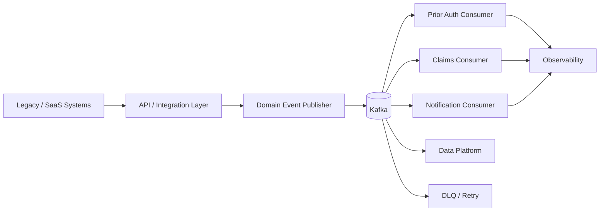

# Healthcare Event-Driven Integration

> Enterprise integration reference architecture for healthcare/PBM workflows using Apache Kafka, domain events, APIs, schema governance, and resilient consumers.

## Purpose

This repository demonstrates an architecture pattern for modernizing legacy healthcare integrations without creating tightly coupled point-to-point dependencies.

### Core patterns

- Domain-driven event boundaries
- Kafka topics by business capability
- Idempotent consumers
- Retry and dead-letter patterns
- Schema evolution
- Correlation and trace IDs
- API + event coexistence
- Consumer isolation
- Observability and operational runbooks

## Reference flow



## Example event

```json
{
  "eventType": "prior-authorization.requested",
  "eventVersion": "1.0",
  "eventId": "01J-DEMO-0001",
  "correlationId": "corr-1001",
  "occurredAt": "2026-09-02T12:00:00Z",
  "payload": {
    "authorizationId": "PA-1001",
    "memberId": "SYNTH-1001",
    "status": "REVIEW_REQUIRED"
  }
}
```

## Production hardening

- Schema Registry with compatibility rules
- Partition key based on aggregate identity
- Idempotency store
- Exponential backoff
- Retry topics and DLQ
- Consumer lag monitoring
- OpenTelemetry propagation
- Encryption and ACLs
- PII/PHI minimization
